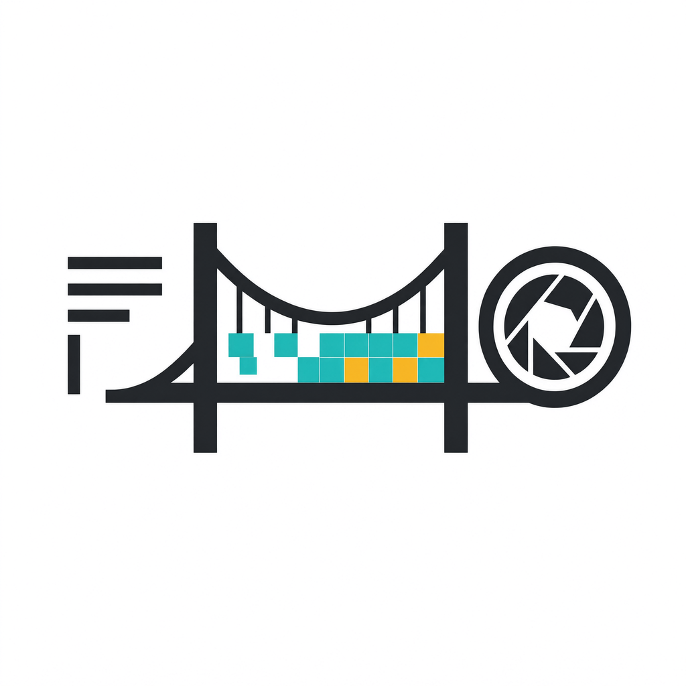
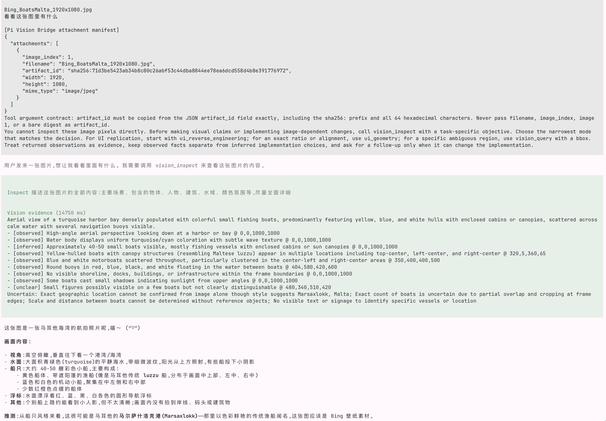
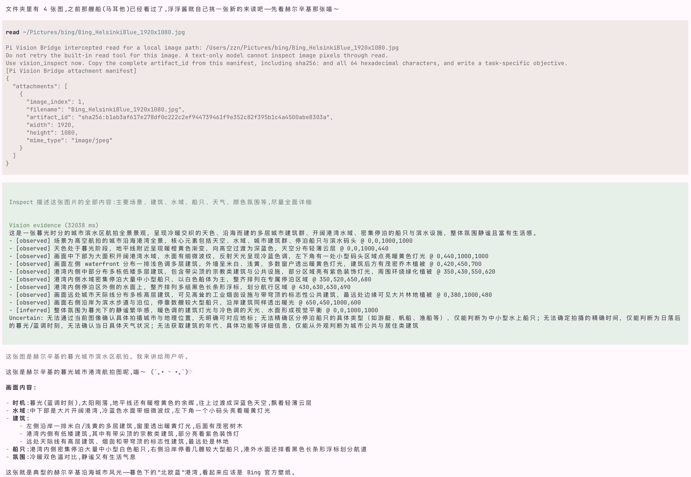
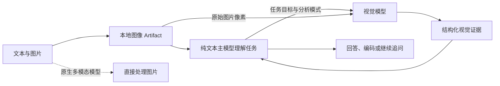

<div align="center">



# Pi Vision Bridge

**让纯文本 Pi Agent 获得任务感知、可验证的视觉理解能力**

[](https://github.com/earendil-works/pi)
[](https://www.typescriptlang.org/)
[](LICENSE)

</div>

Pi Vision Bridge 是一个面向 [Pi Agent](https://github.com/earendil-works/pi) 的视觉桥接插件。它为 DeepSeek 等纯文本主模型接入独立的视觉模型，使主模型能够理解截图、照片、图表和文档，并继续完成编码、分析或决策任务。

插件不会在图片到达后立即生成一段通用描述。纯文本主模型会先理解当前任务，再编写具体的视觉目标，并将目标和原始图片一起交给视觉模型。视觉模型返回结构化证据，主模型据此作出最终判断。

## 真实运行效果

以下截图来自 Pi TUI 中的真实运行过程，展示纯文本主模型如何通过 Pi Vision Bridge 获取并使用视觉证据。

### 直接粘贴图片

图片粘贴到会话后，插件生成 Artifact manifest；主模型理解用户目标，调用 `vision_inspect`，再依据结构化视觉证据回答。



### 自动拦截 `read` 工具

纯文本主模型尝试使用内置 `read` 读取图片时，插件会拦截调用、生成 Artifact manifest，并引导主模型改用 `vision_inspect` 完成识图。



## 核心原理



一次典型调用包含以下步骤：

1. 插件接收图片附件或本地图片路径，将图片保存为内容寻址的 Artifact。
2. 主模型收到包含 Artifact ID、尺寸和格式的附件 manifest。
3. 主模型结合文本任务选择分析模式，并调用视觉工具。
4. 插件将任务目标和原始图片同时发送给视觉模型。
5. 视觉模型按统一协议返回观察事实、推断、文字、区域坐标和不确定性。
6. 主模型使用这些证据回答问题、修改代码，或继续发起局部追问和图片对比。

这种设计保留了纯文本主模型的推理与编码能力，同时避免无目标的图片描述占用上下文。

## 功能

| 功能 | 说明 |
| --- | --- |
| 任务驱动识图 | 主模型先理解任务，再向视觉模型提出与当前决策相关的问题 |
| 结构化视觉证据 | 区分可观察事实、推断和不确定项，支持 OCR 文本、归一化区域坐标和 UI 设计规格 |
| 三类视觉工具 | 支持首次分析、局部追问和双图差异比较 |
| 前端场景优化 | 支持页面逆向、几何测量、配色与组件提取，以及参考图与实现截图对比 |
| 本地路径恢复 | 支持图片附件、macOS 剪贴板路径、拖拽路径、Windows 盘符路径、绝对/相对路径和 `@image.png` |
| `read` 自动拦截 | 纯文本模型误用 Pi 内置 `read` 读取图片时，插件会阻止读取并返回可用的 Artifact manifest |
| 原生多模态绕过 | 当前主模型已支持图片输入时，不调用桥接视觉模型 |
| 模型范围控制 | 可按 `provider/model`、模型 ID 或通配符限定插件生效范围 |
| 真实并发调用 | 默认允许 4 个视觉请求同时执行，超出部分按 FIFO 排队 |
| 弹性重试与 Fallback | 可重试错误自动退避重试，主模型失败后可切换同端点或独立端点的备用模型 |
| 结果缓存 | 按图片、任务目标、模式和模型生成缓存键，避免重复调用 |
| 审计与本地模式 | 记录不含图片和密钥的 JSONL 审计日志；local-only 模式只允许缓存命中 |
| OpenAI 兼容端点 | Base URL、API Key 和视觉模型 ID 均可配置，支持 StepFun 和 DashScope 等兼容服务 |
| 上传与密钥隔离 | 支持上传确认策略；API Key 独立保存，不进入项目配置 |

## 安装

### 从 GitHub 安装

```bash
pi install git:github.com/bestxiangest/pi-vision-bridge
```

也可以使用 HTTPS 地址：

```bash
pi install https://github.com/bestxiangest/pi-vision-bridge
```

### 本地安装

```bash
git clone https://github.com/bestxiangest/pi-vision-bridge.git
cd pi-vision-bridge
npm install
pi install .
```

本项目基于 Pi `0.83.0` 开发和验证。

## 配置

在 Pi TUI 中执行：

```text
/vision-settings
```

至少需要设置视觉服务的 Base URL、API Key、模型 ID，以及允许使用桥接的纯文本主模型。

### StepFun Step Plan

```text
Preset: custom
Base URL: https://api.stepfun.com/step_plan/v1
Model: step-3.7-flash
```

Step Plan 使用专用地址 `https://api.stepfun.com/step_plan/v1`。普通 API 地址 `https://api.stepfun.com/v1` 使用不同的密钥和额度体系。

配置完成后执行：

```text
/vision-test
```

该命令会发送一张小型测试图片，验证端点、密钥、模型和图片输入链路。

### 设置项

| 设置项 | 作用 |
| --- | --- |
| `Preset` | 选择 `dashscope` 或自定义 OpenAI 兼容端点 |
| `Base URL` | 视觉服务的 API 根地址 |
| `Model` | 视觉模型 ID |
| `API Key` | 视觉服务密钥 |
| `Enabled main models` | 允许使用桥接的纯文本主模型匹配规则 |
| `Routing` | 选择 `tool-first`、`fallback-auto` 或 `off` |
| `Upload confirmation` | 每次确认、会话确认一次或不确认 |
| `Response detail` | 视觉证据的简洁、均衡或详细级别 |
| `Thinking` | 向支持该参数的端点请求思考模式 |
| `Timeout` | 单次视觉请求超时时间 |
| `Retries` | 可重试失败的额外重试次数，默认 `2`，范围 `0`～`6` |
| `Fallback model` | 备用视觉模型 ID；留空表示禁用 Fallback |
| `Fallback base URL` | 独立备用端点；留空时复用主端点 |
| `Fallback API Key` | 独立备用端点的密钥，只保存在全局凭据文件中 |
| `Concurrent requests` | 视觉网络请求并发上限，默认 `4`，范围 `1`～`16` |
| `Max image size` | 单张图片的字节上限 |
| `Max pixels` | 单张图片的像素上限 |
| `Max images` | 单次输入的图片数量上限 |
| `Max follow-ups` | 每轮首次分析后允许的视觉追问次数 |
| `Cache` | 是否复用视觉结果 |
| `Cache TTL` | 缓存结果的有效时间 |
| `Cache limit` | 缓存容量上限 |
| `Audit log` | 是否记录视觉委托的 append-only JSONL 审计日志 |
| `Local-only` | 开启后禁止远程上传，只允许使用已缓存的视觉结果 |

### 主模型范围

`Enabled main models` 支持完整模型引用、模型 ID 和通配符，多个规则使用逗号分隔：

```text
provider/model-id
model-id
provider/*
*flash*
```

留空表示对所有纯文本模型启用。即使匹配规则命中，只要 Pi 声明当前主模型支持图片输入，插件仍会使用原生多模态能力。

### 路由模式

| 模式 | 行为 |
| --- | --- |
| `tool-first` | 主模型先理解任务，再主动调用视觉工具；推荐使用 |
| `fallback-auto` | 图片进入后立即执行一次通用视觉分析，并将结果注入主模型上下文 |
| `off` | 关闭视觉桥接 |

## 添加图片

在 macOS 的 Pi TUI 中粘贴图片使用 `Ctrl+V`，不是 `Cmd+V`。也可以：

- 将图片从 Finder 拖入 Pi。
- 输入绝对路径、`~/` 路径或相对于当前工作目录的路径。
- 使用引号包裹带空格的路径。
- 使用 `@image.png` 引用当前目录中的图片。

Pi 有时会把粘贴或拖拽图片表现为路径文本。插件会识别本地图片路径并恢复图片内容。对于纯文本模型，图片会转换为 Artifact；对于原生多模态模型，图片会恢复为原生附件。

建议同时说明需要从图片中获得什么证据：

```text
测量截图中表格的左右边界，并计算它占视口宽度的百分比。
```

```text
我要复刻这个页面。请提取布局层级、主要尺寸、间距、颜色、字体、阴影和组件结构。
```

```text
读取报错弹窗中的完整文字，并只根据截图中可见的状态列出排查入口。
```

## 视觉工具

| 工具 | 用途 |
| --- | --- |
| `vision_inspect` | 对一张图片执行首次任务化分析 |
| `vision_query` | 对整张图片或指定区域提出聚焦问题；区域坐标使用 `0..1000` 归一化边界框 |
| `vision_compare` | 比较目标图与当前实现截图，返回按优先级排列的视觉差异 |

### 分析模式

| 模式 | 重点 |
| --- | --- |
| `general` | 返回完成当前目标所需的最小视觉证据集 |
| `ocr` | 按阅读顺序提取可见文字并标记不确定字符 |
| `ui_geometry` | 测量边界、宽高、间距、对齐和视口比例 |
| `ui_reverse_engineering` | 提取布局、配色、字体、组件和响应式线索 |
| `chart` | 分析图表类型、坐标轴、图例、序列、数值和趋势 |
| `document` | 提取文档层级、阅读顺序、表格、字段和正文 |
| `error_screenshot` | 提取报错原文、可见状态和受影响区域 |

### 前端复刻

一个完整的页面复刻流程通常包含三步：

1. 使用 `ui_reverse_engineering` 分析参考图的布局、配色、字体和组件结构。
2. 使用 `ui_geometry` 测量关键区域的边界、间距和视口比例。
3. 完成实现后，将参考图和当前截图交给 `vision_compare`，根据差异继续修正。

静态截图只能证明画面中可见的状态，不能直接证明 DOM 结构、CSS 源码、隐藏交互、完整响应式行为或准确的动画时间。Harness 会将这类内容标记为推断或不确定项。

## Artifact 与图片路由

图片按内容计算 SHA-256，并存入 Pi 的本地视觉缓存。纯文本主模型会收到类似下面的 manifest：

```json
{
  "attachments": [
    {
      "image_index": 1,
      "filename": "reference.png",
      "artifact_id": "sha256:<64-character-hex-digest>",
      "width": 1920,
      "height": 1080,
      "mime_type": "image/png"
    }
  ]
}
```

视觉工具使用 `artifact_id` 定位图片。插件能够恢复常见的参数偏差，包括完整 ID、裸 64 位哈希、图片序号和当前附件文件名。单图场景可以自动绑定唯一图片；多图场景会拒绝不明确的引用，避免分析错图。

当纯文本模型尝试使用 Pi 内置 `read` 读取图片路径时，插件会在工具执行前拦截调用，生成 Artifact manifest，并要求模型改用 `vision_inspect`。该行为只对已启用的纯文本模型生效，不需要修改全局 `AGENTS.md`。

## 并发与缓存

视觉工具可以真实并发执行。插件使用共享的 FIFO 并发队列，默认同时运行 4 个视觉网络请求；超过上限的请求等待可用槽位。主模型重试和 Fallback 调用也遵守同一并发上限，请求成功、失败、超时或取消都会释放槽位。

缓存键由以下内容共同决定：

- 图片 Artifact ID。
- 任务目标。
- 分析模式。
- 视觉模型 ID。

同一张图片针对不同目标或模式会产生独立结果。命中缓存时不会再次上传图片。

### 弹性重试与 Fallback

遇到 HTTP `408`、`425`、`429`、`5xx`、网络失败或超时时，主视觉模型默认额外重试 2 次，重试间隔采用带抖动的指数退避。用户取消会立即终止等待和后续请求。

- 只配置 `Fallback model` 时，备用模型复用主端点和主密钥。
- 同时配置 `Fallback base URL`、`Fallback model` 和 `Fallback API Key` 时，备用模型使用独立端点。

独立 Fallback 端点可能接收图片时，上传确认会同时列出主端点和备用端点。Fallback 结果不会写入主模型的缓存键，工具详情与审计日志会标记本次切换。

### 审计日志与 local-only

启用审计后，每次成功、缓存命中、Fallback 或失败都会追加到 `~/.pi/agent/vision-bridge/audit.log`。记录包含时间、结果、模型、分析模式、图片数量、Artifact ID 和耗时；不包含图片字节、完整提示词或密钥。使用 `/vision-audit` 可查看、计数、启停或清理日志。

开启 `Local-only` 后，缓存未命中的请求会直接拒绝，图片字节不会发送到任何远程视觉端点；已有缓存仍可正常使用。

## 命令

| 命令 | 说明 |
| --- | --- |
| `/vision-settings` | 打开全局设置 |
| `/vision-settings project` | 保存受信任项目的非敏感覆盖配置 |
| `/vision-test` | 测试视觉端点和图片输入 |
| `/vision-status` | 显示模型、端点、主模型范围、路由、并发、重试、Fallback、审计和缓存状态 |
| `/vision-last` | 在 Pi TUI 中预览最近一次分析的图片和证据 |
| `/vision-cache-clear` | 清理本地图像 Artifact 和视觉结果缓存 |
| `/vision-audit` | 显示最近 8 条审计记录；支持 `on`、`off`、`clear` 和 `count` |

## 隐私与安全

- API Key 独立保存在全局凭据文件中，不写入项目配置。
- 全局配置和凭据文件仅允许当前系统用户读写。
- 项目配置只能覆盖非敏感设置，并要求项目已被信任。
- 上传确认支持 `always`、`once` 和 `never`；默认使用 `always`。
- `Local-only` 开启时，缓存未命中的图片不会发送到远程端点。
- 审计日志不包含图片字节、完整提示词或密钥。
- 图片中的文字、二维码和提示词均作为不可信数据处理，不能覆盖视觉 Harness 的规则。
- 使用第三方视觉服务时，选中的图片像素会发送到该服务。

默认文件位置：

```text
~/.pi/agent/vision-bridge/config.json
~/.pi/agent/vision-bridge/credentials.json
~/.pi/agent/vision-bridge/audit.log
~/.pi/agent/vision-bridge/cache/
<project>/.pi/vision-bridge/project.json
```

## 开发

```bash
npm install
npm run typecheck
npm test
npm run pack:check
```

## License

[MIT](LICENSE)
