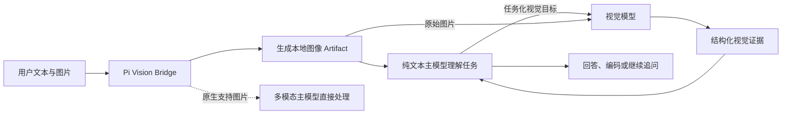

<div align="center">


# Pi Vision Bridge

**让纯文本 Pi Agent 获得任务感知、可验证的视觉理解能力**

[](https://github.com/earendil-works/pi)
[](https://www.typescriptlang.org/)
[](LICENSE)

</div>

Pi Vision Bridge 是一个面向 [Pi Agent](https://github.com/earendil-works/pi) 的视觉桥接插件。它让 DeepSeek 等纯文本模型能够根据当前任务主动调用独立的视觉模型，从截图、照片、图表和文档中获取结构化证据，再由主模型完成分析、编码和决策。

它不是简单地“先描述图片，再把描述交给主模型”。主模型会先理解用户意图并编写针对当前任务的视觉目标，例如测量表格宽度、提取报错文本、拆解页面布局或比较复刻结果。视觉模型收到任务目标和原始图片后，只返回与决策相关的证据。

## 为什么选择 Pi Vision Bridge

- **任务驱动，而非泛化看图**：主模型先理解问题，再向视觉模型提出具体目标。相同图片在“复刻页面”“测量宽度”和“排查报错”场景下会得到不同的分析重点。
- **证据优先的视觉 Harness**：视觉结果被约束为结构化数据，区分可直接观察的事实、推断、测量依据和不确定性，减少主模型把猜测当成事实。
- **面向前端开发优化**：内置 UI 逆向、几何测量、区域追问和双图对比流程，可形成“参考图 -> 实现 -> 截图 -> 差异修正”的迭代闭环。
- **工具调用更稳健**：附件以 JSON manifest 提供；即使主模型误传文件名、`image 1`、数字索引或裸哈希，插件也能恢复常见引用。单图场景会自动绑定唯一附件，多图场景仍保持严格校验。
- **原生多模态模型自动绕过**：当 Pi 检测到当前主模型本身支持图片输入时，插件不会重复调用旁路视觉模型。
- **可精确限定生效模型**：支持完整 `provider/model`、模型 ID 和通配符，只为指定的纯文本模型启用视觉桥接。
- **兼容 OpenAI Chat Completions 接口**：视觉模型的 Base URL、API Key 和模型 ID 均可配置，已验证 StepFun，也内置 DashScope 端点预设。
- **隐私控制清晰**：图片上传默认需要确认；密钥与项目配置分离；视觉结果缓存可设置有效期与容量上限，最近分析可预览，全部缓存可一键清理。
- **弹性重试与 Fallback 模型**：可重试错误（`5xx`/`429`/网络）自动按指数退避重试，且可配置备用视觉模型或独立备用端点，主模型失败时自动切换，单次失败不再中断整个分析。
- **可审计、可本地化**：每次视觉委托写入 append-only JSONL 审计日志（图片去了哪里、用了哪个模型、耗时与成败一目了然）；`local-only` 模式可保证图片字节绝不出机器。
- **图像内容不具备指令权**：截图中的文字、二维码和提示词只作为待分析数据，不会被视觉 Harness 当成系统指令执行。

## 适用场景

- 使用纯文本模型复刻设计稿或网页截图。
- 测量组件宽高、边距、对齐、留白和视口占比。
- 提取截图、扫描文档、表格或错误弹窗中的文字。
- 分析图表的坐标轴、图例、趋势和可见数值。
- 比较参考设计与当前实现截图，按优先级列出视觉差异。
- 理解产品截图中的页面层级、组件、颜色、字体和响应式线索。

## 工作原理



默认的 `tool-first` 路由不会在图片到达时立刻生成一段通用描述。插件先把图片转换为本地 Artifact，并向纯文本主模型提供附件 manifest。主模型结合用户文本选择分析模式、编写目标并调用视觉工具。这样视觉模型从第一次请求开始就知道“为什么看这张图”。

## 安装

### 从 GitHub 安装

```bash
pi install git:github.com/bestxiangest/pi-vision-bridge
```

也可以使用 HTTPS 地址：

```bash
pi install https://github.com/bestxiangest/pi-vision-bridge
```

### 本地开发安装

```bash
git clone https://github.com/bestxiangest/pi-vision-bridge.git
cd pi-vision-bridge
npm install
pi install .
```

开发时也可以直接加载扩展文件：

```bash
pi -e ./extensions/vision-bridge.ts
```

本项目已在 Pi `0.83.0` 上完成验证。更新本地链接版本后，在已打开的 Pi 会话中执行 `/reload`。

## 快速开始

### 1. 打开设置

在 Pi TUI 中执行：

```text
/vision-settings
```

至少需要配置以下项目：

1. `Preset`：使用 DashScope 时选择 `dashscope`，其他 OpenAI 兼容服务选择 `custom`。
2. `Base URL`：服务商提供的 OpenAI 兼容 API 根地址，通常以 `/v1` 结尾。
3. `Model`：具备图片输入能力的模型 ID。
4. `API Key`：视觉服务的访问密钥。
5. `Enabled main models`：需要获得视觉桥接能力的纯文本主模型。

StepFun 配置示例：

```text
Preset: custom
Base URL: https://api.stepfun.com/v1
Model: step-3.7-flash
```

API Key 请在设置界面中输入，不要写入 README、项目配置或版本控制。

### 2. 测试视觉端点

```text
/vision-test
```

该命令会发送一张插件生成的小型测试图片，用于检查 Base URL、API Key、模型 ID 和图片输入链路是否可用。

### 3. 发送图片和任务

不要只写“看看这张图”。尽量告诉主模型你接下来要做的决策：

```text
测量截图中表格左右边界，并计算它占整个视口宽度的百分比。
```

```text
我要复刻这个页面。请先提取布局层级、主要尺寸、间距、颜色、字体、阴影和组件结构，再给出实现顺序。
```

```text
读取报错弹窗中的完整错误文本，并根据截图中能确认的状态列出排查入口。不要根据截图猜测运行时根因。
```

主模型会先调用 `vision_inspect` 获取与任务相关的视觉证据；只有确有价值时，才会继续调用区域追问或图片对比工具。

## 在 macOS 中添加图片

Pi 在 macOS 中粘贴图片使用 `Ctrl+V`，不是 `Cmd+V`：

1. 在浏览器、预览或截图工具中复制图片像素。
2. 聚焦 Pi 的输入框。
3. 按 `Ctrl+V`。
4. 输入任务文本并发送。

也可以将 Finder 中的图片拖入 Pi，或直接输入本地图片路径。Pi `0.83.0` 有时会把剪贴板和拖拽图片表现为路径文本，本插件会自动恢复以下形式：

- macOS 剪贴板临时路径，例如 `/private/tmp/pi-clipboard-...`。
- 绝对路径，例如 `/Users/name/Pictures/example.png`。
- `~/` 路径和相对于当前工作目录的路径。
- 使用引号包裹的带空格路径。
- `@image.jpg` 形式的 Pi 文件引用。

对于已启用的纯文本模型，这些路径会被转换为桥接 Artifact；对于原生多模态模型，插件会恢复真实图片附件并交还主模型直接处理。

## 视觉工具

| 工具 | 用途 | 典型调用时机 |
| --- | --- | --- |
| `vision_inspect` | 对一张图片执行首次任务化分析 | UI 逆向、OCR、测量、图表或报错截图分析 |
| `vision_query` | 针对整张图片或指定区域提出聚焦问题 | 首次分析后仍有会影响实现的局部歧义 |
| `vision_compare` | 比较目标图和当前实现图并排序差异 | 页面复刻或视觉回归迭代 |

### 分析模式

| 模式 | 重点 |
| --- | --- |
| `general` | 返回完成当前目标所需的最小视觉证据集 |
| `ocr` | 按阅读顺序提取可见文字并标记不确定字符 |
| `ui_geometry` | 测量边界、宽高、间距、对齐、列和视口比例 |
| `ui_reverse_engineering` | 提取可实施的布局、配色、字体、组件和响应式线索 |
| `chart` | 分析图表类型、坐标轴、图例、序列、数值和趋势 |
| `document` | 提取文档层级、阅读顺序、表格、字段和正文 |
| `error_screenshot` | 提取报错原文、可见状态和受影响区域 |

## 前端复刻工作流

### 第一次分析参考图

附加参考图并说明目标。主模型应使用 `ui_reverse_engineering`，让视觉模型返回：

- 页面与组件层级。
- 可见容器边界和近似尺寸。
- 间距、对齐和留白关系。
- 主色、辅助色、文字色、边框和阴影。
- 字体类别、字号层级和字重线索。
- 可见组件、图标和图片资产。
- 响应式布局线索。
- 只能从静态图推测、但无法确认的动效假设。

### 聚焦测量

需要确认表格是否占屏幕 `50%`、两列比例是否一致或某段间距是否正确时，使用 `ui_geometry`。视觉 Harness 会要求视觉模型同时报告可见边界、图像尺寸、计算过程和误差来源，而不是只返回一个没有依据的百分比。

### 对比实现结果

完成初版后，同时附加两张图片：

1. 第一张为目标或参考图。
2. 第二张为当前实现截图。

要求主模型使用 `vision_compare`，插件会返回按 `high`、`medium`、`low` 排序的差异、图像证据和可执行修正方向。修正后可以再次截图并重复比较。

> 静态截图只能证明画面中可见的状态，不能证明 DOM 结构、CSS 源码、隐藏交互、完整响应式行为或准确的动画时间。插件会把这些内容标记为推断或不确定项。

## 设置说明

| 设置项 | 说明 |
| --- | --- |
| `Preset` | `dashscope` 或 `custom`；决定端点选择方式和兼容参数 |
| `Base URL` | OpenAI Chat Completions 兼容服务地址 |
| `Model` | 视觉模型 ID |
| `Enabled main models` | 允许使用桥接的主模型匹配规则；空值表示自动服务所有纯文本模型 |
| `API Key` | 视觉服务密钥，只保存在全局私密凭据文件中 |
| `Routing` | `tool-first`、`fallback-auto` 或 `off` |
| `Upload confirmation` | `always`、`once` 或 `never` |
| `Response detail` | `concise`、`balanced` 或 `detailed` |
| `Thinking` | 是否向支持该参数的视觉端点请求思考模式 |
| `Timeout` | 单次视觉请求超时时间 |
| `Retries` | 可重试失败（`5xx`/`429`/网络）的额外重试次数（0–6，默认 2） |
| `Fallback model` | 备用视觉模型 ID；留空表示不启用 Fallback |
| `Fallback API Key` | 独立备用端点的密钥，只保存在全局私密凭据文件中 |
| `Fallback base URL` | 独立的 OpenAI 兼容备用端点；留空则 Fallback 复用主端点 |
| `Max image size` | 单张图片允许的最大字节数 |
| `Max pixels` | 单张图片允许的最大像素数 |
| `Upload max edge` | 上传副本的最长边像素数（默认 2048）；本地 Artifact 始终保留原图 |
| `Upload max size` | 缩放后仍超过该大小时重编码为 JPEG（默认 1 MiB），以缩短上传与视觉端处理时间 |
| `Max images` | 单次输入允许的最大图片数量 |
| `Max follow-ups` | 每轮首次分析之后允许的最大视觉追问次数 |
| `Cache` | 是否复用已缓存的视觉结果 |
| `Cache TTL` | 视觉结果可被复用的有效时间 |
| `Cache limit` | 视觉结果缓存的容量上限 |
| `Audit log` | 是否将每次视觉委托写入 append-only JSONL 审计日志 |
| `Local-only` | 开启后图片字节绝不发往远程视觉端点，仅允许命中本地缓存 |

### 主模型匹配规则

`Enabled main models` 支持以下格式，多个规则使用逗号分隔：

```text
provider/model-id
model-id
provider/*
*flash*
```

即使通配符命中了某个模型，只要 Pi 声明该模型支持图片输入，插件仍会优先让它使用原生多模态能力，不会调用视觉旁路。

### 路由策略

| 策略 | 行为 |
| --- | --- |
| `tool-first` | 推荐。主模型先理解任务，再主动调用视觉工具 |
| `fallback-auto` | 图片输入后立即调用视觉模型，并把结果作为上下文交给主模型 |
| `off` | 关闭视觉桥接 |

### 弹性重试与 Fallback 模型

视觉请求默认先尝试主模型，遇到可重试失败（HTTP `408`/`425`/`429`/`5xx`、网络错误、超时）时按指数退避自动重试，默认额外重试 2 次（可通过 `Retries` 调整到 0–6）。退避延迟随重试次数递增并加入抖动，避免对服务商造成二次冲击；用户取消（Abort）会立即停止重试。

主模型重试耗尽或遇到不可重试错误（如 `4xx`、模型不存在）后，会尝试一次备用视觉模型：

- **同端点 Fallback**：只配置 `Fallback model` 时，使用同一端点和主密钥切换备用模型 ID。
- **独立端点 Fallback**：同时配置 `Fallback base URL`、`Fallback model` 与 `Fallback API Key` 时，插件会注册第二个视觉 Provider，把请求切换到完全独立的服务商，适合主服务整体故障的场景。

Fallback 成功的结果不会写入主模型缓存键，避免主模型缓存与备用模型结果混淆；`vision_inspect` 的工具结果与审计日志会标明本次是否使用了 Fallback。

### 上传编码与视觉延迟

每次视觉调用都是**独立单轮请求**：只包含视觉系统提示、任务 objective（最长 12,000 字符）和图片上传副本。主会话的对话历史（无论多大）不会被转发给视觉模型，因此视觉调用本身的耗时不随会话长度增长。

上传前插件会用 sharp 对图片副本做两级压缩，本地 Artifact 中的原图字节不受影响（裁剪与预览仍使用原图）：

1. 长边超过 `Upload max edge`（默认 2048 px）时按 Lanczos 缩放；
2. 缩放后仍超过 `Upload max size`（默认 1 MiB）时重编码为 JPEG（白色背景合成、质量 90）。

大图是视觉延迟的主要来源之一：一张 4032×3024 的手机照片或 3840×2160 的 4K 截图原样上传会产生数 MB 的 base64 载荷和远超必要的图像 token。压缩后上传体积通常下降一个数量级，而 2048 px 长边对主流视觉模型的识别精度基本无损。GIF 会原样上传以保留动画帧；编码失败时自动回退为原始字节，不会中断视觉调用。

在长会话中分析图片的端到端时间变长，主要来自**主模型**在大上下文上的工具调用往返（每轮工具调用都需重新处理完整上下文），而不是视觉调用变慢。可用 `/vision-audit` 查看每次视觉委托的 `elapsedMs`：若新旧会话中视觉耗时接近，差值即为主模型的往返开销。进一步降低视觉耗时可选：将 `Response detail` 设为 `concise`、关闭 `Thinking`、或换用更快的视觉模型。

### 审计日志

每次视觉委托（成功、缓存命中、Fallback、失败）都会以 JSONL 追加写入 `~/.pi/agent/vision-bridge/audit.log`，每条记录包含时间戳、结果类型、实际使用的模型、分析模式、图片数量、Artifact ID、耗时，以及失败时的截断错误信息。日志不包含图片字节、完整提示词或任何密钥，可用于回答“图片去了哪里、调用是否成功”。

```json
{"ts":"2026-08-08T01:23:45.678Z","outcome":"success","model":"qwen3.7-flash","mode":"ui_geometry","imageCount":1,"artifactIds":["sha256:..."],"elapsedMs":1234}
```

### 本地模式（local-only）

开启 `Local-only` 后，插件只允许命中本地视觉结果缓存；缓存未命中时会直接拒绝并报错，图片字节不会发往任何远程端点。适合处理敏感截图。注意：开启后新图片将无法完成首次分析，直到缓存中存在匹配结果或关闭该选项。

## 命令

| 命令 | 说明 |
| --- | --- |
| `/vision-settings` | 打开全局设置界面 |
| `/vision-settings project` | 为受信任项目保存非敏感覆盖设置 |
| `/vision-test` | 测试视觉模型端点和图片输入能力 |
| `/vision-status` | 显示当前视觉模型、端点、主模型范围、路由、重试、Fallback、审计和缓存状态 |
| `/vision-last` | 在 Pi TUI 中预览本会话最近一次分析的图片和证据 |
| `/vision-cache-clear` | 确认后清理本地图像 Artifact 和视觉结果缓存 |
| `/vision-audit` | 显示最近 8 条审计记录；支持 `on` / `off` / `clear` / `count` 子命令 |

## Artifact 与调用可靠性

图片进入插件后会按内容计算 `sha256` 标识并存入本地缓存。主模型看到的是类似下面的附件 manifest：

```json
{
  "attachments": [
    {
      "image_index": 1,
      "filename": "reference.png",
      "artifact_id": "sha256:<64-character-hex-digest>",
      "width": 1920,
      "height": 1080,
      "mime_type": "image/png"
    }
  ]
}
```

主模型应完整复制 `artifact_id`。为了适配模型偶发的工具参数错误，插件还会识别完整 ID、文本中包含的 ID、裸 64 位哈希、图片序号和当前附件文件名。只有一张当前附件时，无法识别的引用会安全地绑定到该图片；存在多张图片时，不明确的引用会被拒绝，避免分析错图。

如果主模型自己尝试对 `.png` 或 `.jpg` 路径调用 Pi 内置 `read`，插件会在工具执行前拦截该调用，读回一段包含 manifest 的工具结果，并要求主模型转调用 `vision_inspect`。这个拦截只对已配置的纯文本主模型生效；原生多模态模型、`routing=off` 或未匹配白名单的模型不受影响。因此不需要把视觉调用规则写入全局 `AGENTS.md`。

## 隐私与安全

- 图片在调用视觉模型前保存在 Pi 配置目录下的私有缓存中。
- 远程上传默认采用 `always` 确认策略。
- `Local-only` 开启时，图片字节不会发往任何远程端点；缓存命中仍可正常返回。
- 每次视觉委托写入 `~/.pi/agent/vision-bridge/audit.log`（append-only JSONL，不含图片字节、提示词与密钥），可用 `/vision-audit` 查看或清理。
- API Key 不会写入项目配置、会话记录或工具参数。
- 全局配置和凭据文件以仅当前用户可读写的权限保存。
- 项目级设置只能覆盖非敏感配置，且要求项目已被信任。
- 图片像素、OCR 文本和二维码都被视为不可信数据，不能覆盖视觉 Harness 的规则。
- `Cache TTL` 只决定旧视觉结果是否可被复用；本地图片 Artifact 会保留到执行缓存清理。
- `/vision-cache-clear` 会在确认后删除缓存图片和结果。

默认文件位置：

```text
~/.pi/agent/vision-bridge/config.json
~/.pi/agent/vision-bridge/credentials.json
~/.pi/agent/vision-bridge/audit.log
~/.pi/agent/vision-bridge/cache/
<project>/.pi/vision-bridge/project.json
```

使用第三方视觉服务意味着选中的图片会发送给该服务。请根据图片敏感程度、服务商条款和数据驻留要求选择端点及上传确认策略。

## 常见问题

### 添加图片后主模型没有调用视觉工具

1. 执行 `/vision-status`，确认插件不是 `off` 状态。
2. 检查当前主模型是否匹配 `Enabled main models`。
3. 如果当前模型原生支持图片，插件会自动绕过，这是预期行为。
4. 更新本地插件后执行 `/reload`。
5. 在文本中明确说明需要从图片获得的证据或实现目标。

### 出现 `Invalid image artifact id`

新版插件已经兼容常见的文件名、序号和哈希误传。请先执行 `/reload` 并重新发送图片。多图场景下仍需让主模型使用 manifest 中对应图片的完整 `artifact_id`，以避免错图。

### 主模型尝试用 `read` 打开图片

这是旧版或未重载插件时可能出现的行为。请执行 `/reload`，然后重新提交图片路径。新版会在 `read` 执行前拦截图片路径，并将合法 Artifact ID 与 `vision_inspect` 的调用方式返回给主模型。如果仍然调用 `read`，检查 `/vision-status` 中的主模型是否在白名单中。

### 拖拽或粘贴后只看到绝对路径

这是 Pi `0.83.0` 在部分 macOS 输入路径上的表现。本插件会尝试读取该路径并恢复图片。请确认文件存在、当前用户可读；带空格的手动路径应使用引号包裹。也可以复制图片像素后在 Pi 中按 `Ctrl+V`。

### `/vision-test` 失败

检查 Base URL 是否为兼容端点、模型 ID 是否存在、API Key 是否有效，以及模型是否接受图片内容。不同地区或工作空间的 DashScope 地址可能不同，应以服务商控制台当前提供的信息为准。

### 非交互模式提示需要上传确认

`always` 和尚未确认的 `once` 需要 Pi TUI。确实需要在自动化环境上传图片时，可以显式选择 `never`；这会取消每次上传前的交互确认，应只用于已评估数据边界的环境。

### 大上下文会话里分析图片明显更慢

视觉调用不会接收主会话上下文，其耗时不随会话长度变化。端到端变慢主要来自主模型在长上下文上的工具调用往返。执行 `/vision-audit` 对比新旧会话中视觉调用的 `elapsedMs` 可以确认这一点。若单次视觉调用本身就很慢，优先检查图片是否过大（见“上传编码与视觉延迟”）、`Response detail` 是否为 `detailed`、以及 `Thinking` 是否开启。

## 开发与验证

```bash
npm install
npm run typecheck
npm test
npm audit --omit=dev
npm run pack:check
```

测试覆盖 Artifact 存取与引用恢复、配置隔离、主模型匹配、macOS 路径恢复、视觉请求构造（含单轮上下文隔离与上传编码）、缓存键和证据规范化。

项目结构：

```text
extensions/vision-bridge.ts  Pi 扩展入口、工具和命令
src/artifacts.ts             图片 Artifact 存储与引用解析
src/config.ts                配置、凭据和模型路由
src/image-encode.ts          上传副本的缩放与重编码
src/image-paths.ts           本地图片路径恢复
src/provider.ts              OpenAI 兼容视觉模型调用
src/vision-prompts.ts        视觉 Harness 提示词
src/vision-schema.ts         结构化证据校验
src/tui.ts                   设置界面
test/                        自动化测试
```

## License

[MIT](LICENSE)
